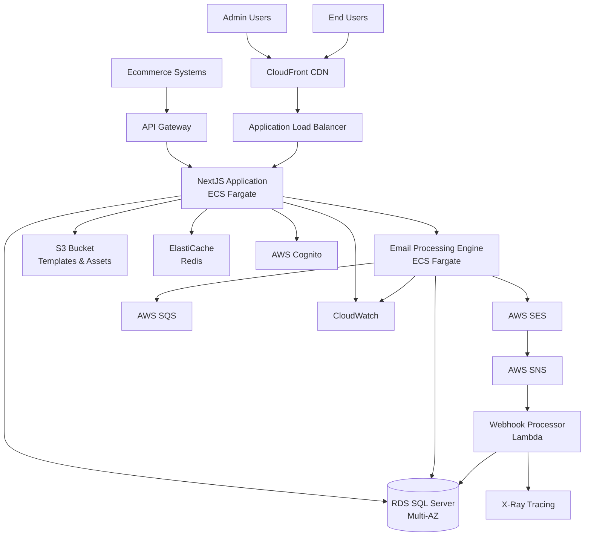
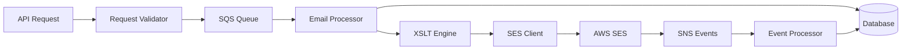
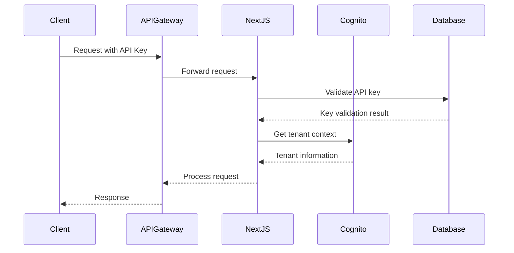
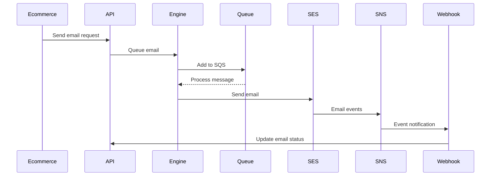
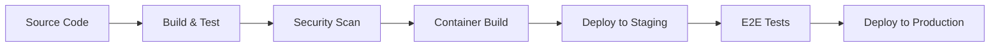

# High-Level Architecture - Email Platform

## Overview

The Email Platform is a cloud-native, multitenant transactional email service built on AWS. It provides complete email lifecycle management from template creation to delivery tracking, with comprehensive analytics and compliance features.

## Architectural Principles

### 1. **Multitenant by Design**
- Complete tenant isolation at data and application layers
- Shared infrastructure with tenant-specific configurations
- Row-level security for database access
- Tenant-scoped authentication and authorization

### 2. **Event-Driven Architecture**
- Asynchronous email processing through SQS
- Real-time event tracking via SNS webhooks
- Microservices communication through events
- Eventual consistency where appropriate

### 3. **Serverless-First Approach**
- ECS Fargate for container orchestration
- Lambda functions for event processing
- S3 for static assets and template storage
- API Gateway for external integrations

### 4. **Security by Default**
- Encryption in transit and at rest
- Least privilege access controls
- Comprehensive audit logging
- GDPR and compliance ready

## System Architecture Diagram



## Component Architecture

### 1. **Frontend Layer (NextJS Application)**

#### Core Components:
- **Dashboard Module**: Tenant-specific metrics and KPIs
- **Template Editor**: XSLT/HTML editor with real-time preview
- **Analytics Module**: Charts, reports, and data visualization
- **Configuration Panel**: Tenant settings and email configurations
- **User Management**: Role-based access control

#### Key Features:
- Server-side rendering for performance
- Component-based architecture with Shadcn/ui
- Real-time updates via Server-Sent Events
- Responsive design for mobile and desktop
- Progressive Web App capabilities

#### File Structure:
```
src/
├── app/                    # Next.js 14+ App Router
│   ├── (dashboard)/        # Dashboard routes
│   ├── (auth)/            # Authentication routes
│   ├── api/               # API routes
│   └── globals.css        # Global styles
├── components/            # Reusable components
│   ├── ui/               # Base UI components
│   ├── charts/           # Chart components
│   ├── forms/            # Form components
│   └── layouts/          # Layout components
├── lib/                  # Utility functions
│   ├── auth.ts           # Authentication helpers
│   ├── db.ts             # Database connection
│   ├── email.ts          # Email service client
│   └── utils.ts          # General utilities
├── types/                # TypeScript type definitions
└── hooks/                # Custom React hooks
```

### 2. **API Layer (NextJS API Routes)**

#### Email API (`/api/v1/emails/*`)
```typescript
// Email sending endpoint
POST /api/v1/emails/send
GET  /api/v1/emails/{id}/status
GET  /api/v1/emails
DELETE /api/v1/emails/{id}

// Bulk operations
POST /api/v1/emails/bulk/send
GET  /api/v1/emails/bulk/{batchId}/status
```

#### Template API (`/api/v1/templates/*`)
```typescript
// CRUD operations
GET    /api/v1/templates
POST   /api/v1/templates
GET    /api/v1/templates/{id}
PUT    /api/v1/templates/{id}
DELETE /api/v1/templates/{id}

// Template operations
POST   /api/v1/templates/{id}/preview
POST   /api/v1/templates/{id}/test-send
GET    /api/v1/templates/{id}/variables
```

#### Analytics API (`/api/v1/analytics/*`)
```typescript
// Dashboard analytics
GET /api/v1/analytics/dashboard?period=30d
GET /api/v1/analytics/summary?from=...&to=...
GET /api/v1/analytics/charts/volume
GET /api/v1/analytics/charts/performance

// Detailed reports
GET /api/v1/analytics/reports/delivery
GET /api/v1/analytics/reports/engagement
POST /api/v1/analytics/reports/export
```

#### Configuration API (`/api/v1/config/*`)
```typescript
// Tenant configuration
GET /api/v1/config/tenant
PUT /api/v1/config/tenant

// Email type configurations
GET /api/v1/config/email-types
PUT /api/v1/config/email-types/{type}

// User management
GET /api/v1/config/users
POST /api/v1/config/users
PUT /api/v1/config/users/{id}
DELETE /api/v1/config/users/{id}
```

### 3. **Email Processing Engine**

#### Architecture:


#### Key Components:

**Request Validator**
- Schema validation using Zod
- Rate limiting per tenant
- Template existence verification
- Recipient validation

**Queue Manager**
- SQS integration for reliable delivery
- Priority queues for different email types
- Dead letter queues for failed messages
- Batch processing optimization

**Template Engine**
- XSLT processor with caching
- Variable substitution and validation
- HTML/text output generation
- Error handling and fallbacks

**SES Integration**
- Configuration set management
- Bounce and complaint handling
- Reputation monitoring
- Send rate optimization

**Event Processor**
- SNS webhook processing
- Event deduplication
- Database updates
- Real-time notifications

### 4. **Database Layer (SQL Server)**

#### Connection Management:
- Connection pooling with configurable limits
- Read replicas for analytics queries
- Connection encryption (TLS 1.3)
- Automatic failover handling

#### Performance Optimizations:
- Clustered indexes on high-volume tables
- Partitioning for time-series data
- Query plan caching
- Statistics auto-update

#### Security Features:
- Row-level security for tenant isolation
- Column-level encryption for sensitive data
- Audit logging for compliance
- Backup encryption

### 5. **Caching Layer (ElastiCache Redis)**

#### Cache Strategy:
```typescript
// Template caching
`template:${tenantId}:${templateType}` -> Template object (TTL: 1h)

// Configuration caching
`config:${tenantId}` -> Tenant configuration (TTL: 30m)

// Analytics caching
`analytics:${tenantId}:${period}:${hash}` -> Analytics data (TTL: 5m)

// Rate limiting
`ratelimit:${tenantId}:${minute}` -> Request count (TTL: 1m)
```

#### Cache Patterns:
- **Write-Through**: Configuration updates
- **Write-Behind**: Analytics aggregations
- **Cache-Aside**: Template and user data
- **Refresh-Ahead**: Predictive cache warming

## Integration Patterns

### 1. **External API Integration**

#### Authentication Flow:


#### Rate Limiting:
- Token bucket algorithm
- Per-tenant and per-API key limits
- Burst capacity configuration
- Sliding window implementation

### 2. **Email Delivery Flow**



### 3. **Real-time Updates**

#### Server-Sent Events (SSE):
```typescript
// Dashboard real-time updates
GET /api/sse/dashboard
  - Email send notifications
  - Delivery status updates
  - Error alerts
  - Performance metrics

// Email status tracking
GET /api/sse/emails/{emailId}
  - Delivery confirmation
  - Open/click events
  - Bounce/complaint alerts
```

## Security Architecture

### 1. **Authentication & Authorization**

#### Multi-layer Security:
```
User Request
    ↓
CloudFront (WAF, DDoS Protection)
    ↓
ALB (SSL Termination, IP Filtering)
    ↓
NextJS (JWT Validation, Rate Limiting)
    ↓
Database (Row-level Security)
```

#### JWT Token Structure:
```json
{
  "sub": "user-uuid",
  "tenant_id": "tenant-uuid", 
  "role": "admin|editor|viewer",
  "permissions": ["email.send", "template.edit"],
  "iat": 1640995200,
  "exp": 1640998800
}
```

### 2. **Data Protection**

#### Encryption Strategy:
- **In Transit**: TLS 1.3 for all connections
- **At Rest**: AES-256 for database and S3
- **Application**: Field-level encryption for PII
- **Key Management**: AWS KMS with rotation

#### Tenant Isolation:
```sql
-- Row-level security policy example
CREATE SECURITY POLICY tenant_isolation_policy
ADD FILTER PREDICATE tenant_id = CAST(SESSION_CONTEXT(N'tenant_id') AS UNIQUEIDENTIFIER)
ON EmailLogs;
```

### 3. **Compliance Features**

#### GDPR Compliance:
- Right to be forgotten implementation
- Data portability exports
- Consent management
- Privacy by design

#### Audit Logging:
```typescript
interface AuditLog {
  tenant_id: string;
  user_id: string;
  action: string;
  entity_type: string;
  entity_id: string;
  old_values?: object;
  new_values?: object;
  ip_address: string;
  user_agent: string;
  timestamp: Date;
}
```

## Monitoring & Observability

### 1. **Application Monitoring**

#### Key Metrics:
- **Email Metrics**: Send rate, delivery rate, bounce rate
- **Performance**: API response times, template processing time
- **Errors**: Failed sends, template errors, API errors
- **Usage**: Emails per tenant, storage usage, API calls

#### Alerting Thresholds:
```yaml
critical_alerts:
  - failed_email_sends_rate > 5%
  - api_latency_p95 > 2000ms
  - database_connection_failures > 0

warning_alerts:
  - bounce_rate > 2%
  - template_processing_time > 500ms
  - queue_depth > 1000

info_alerts:
  - daily_volume_increase > 50%
  - new_tenant_registration
```

### 2. **Infrastructure Monitoring**

#### CloudWatch Dashboards:
- **Application Health**: Service uptime, error rates
- **Resource Utilization**: CPU, memory, network
- **Database Performance**: Query performance, connections
- **Cost Optimization**: Resource usage, spending trends

#### X-Ray Tracing:
- End-to-end request tracing
- Service dependency mapping
- Performance bottleneck identification
- Error root cause analysis

### 3. **Business Intelligence**

#### Analytics Pipeline:
```
EmailLogs → Data Pipeline → Analytics Database → BI Tools
    ↓
Real-time Stream → Kinesis → Lambda → Aggregations
```

#### Key Reports:
- Daily/Weekly/Monthly email volume
- Delivery performance by tenant
- Template performance comparison
- Cost per email analysis

## Deployment Architecture

### 1. **Environment Strategy**

#### Environments:
- **Development**: Single-tenant, reduced resources
- **Staging**: Multi-tenant, production-like
- **Production**: Full multi-tenant, high availability

#### Infrastructure as Code:
```
terraform/
├── modules/
│   ├── networking/     # VPC, subnets, security groups
│   ├── compute/        # ECS, ALB, Auto Scaling
│   ├── database/       # RDS, ElastiCache
│   ├── storage/        # S3, EFS
│   └── monitoring/     # CloudWatch, X-Ray
├── environments/
│   ├── dev/
│   ├── staging/
│   └── production/
└── shared/            # Route53, ACM, IAM
```

### 2. **CI/CD Pipeline**

#### Build Pipeline:


#### Deployment Strategy:
- **Blue-Green Deployment** for zero-downtime updates
- **Canary Releases** for gradual rollouts
- **Feature Flags** for safe feature releases
- **Automated Rollback** on health check failures

### 3. **Scaling Strategy**

#### Auto Scaling Policies:
```yaml
ecs_service_scaling:
  target_cpu_utilization: 70%
  min_capacity: 2
  max_capacity: 20
  scale_out_cooldown: 300s
  scale_in_cooldown: 600s

database_scaling:
  read_replica_threshold: 80%
  storage_autoscaling: enabled
  max_storage: 1000GB
```

#### Performance Targets:
- **API Response Time**: < 200ms (95th percentile)
- **Email Processing**: > 10,000 emails/minute
- **Database Queries**: < 100ms (average)
- **Template Rendering**: < 500ms per template

This architecture provides a robust, scalable, and secure foundation for the Email Platform while maintaining flexibility for future enhancements and integrations.