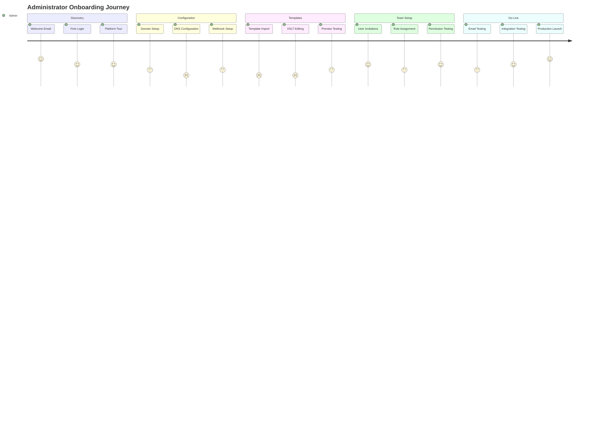
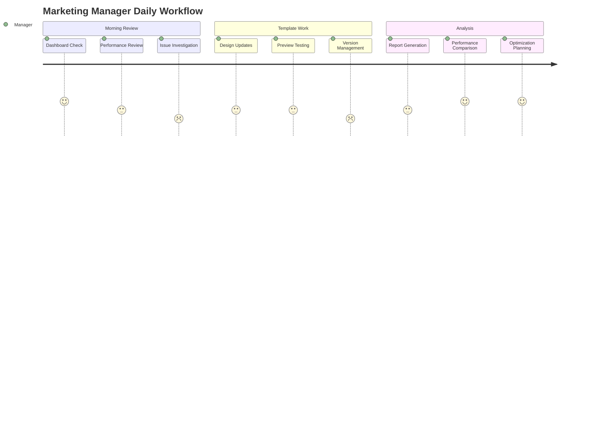
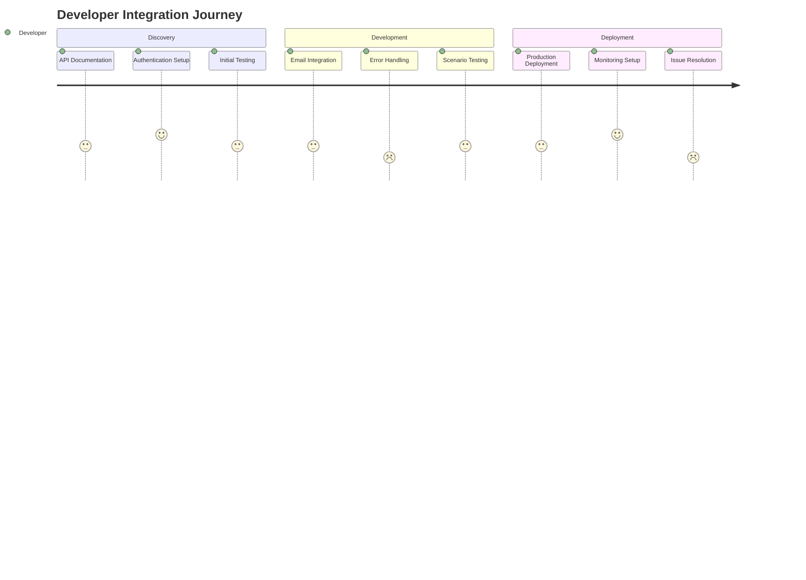
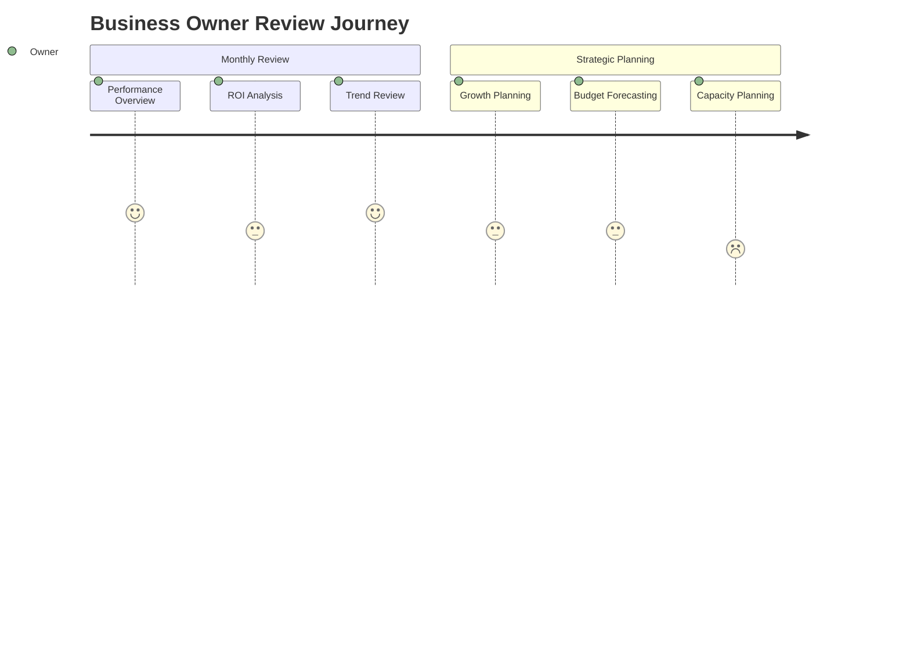

# User Journey Maps - Email Platform

## Overview

User journey maps document the complete experience flows for different types of users interacting with the Email Platform. These maps help identify pain points, optimization opportunities, and ensure a seamless user experience.

## Primary User Personas

### 1. **Email Platform Administrator**
- **Role**: Manages tenant configuration and users
- **Goals**: Configure email settings, monitor performance, manage users
- **Pain Points**: Complex configurations, lack of visibility into issues
- **Tech Savvy**: High

### 2. **Marketing Manager**
- **Role**: Creates and manages email campaigns
- **Goals**: Design templates, track engagement, optimize performance
- **Pain Points**: Limited design skills, complex analytics
- **Tech Savvy**: Medium

### 3. **Developer/Integration Manager**
- **Role**: Integrates ecommerce with email platform
- **Goals**: Reliable API integration, debugging tools, documentation
- **Pain Points**: API complexity, troubleshooting integration issues
- **Tech Savvy**: High

### 4. **Business Owner**
- **Role**: Oversees email strategy and ROI
- **Goals**: Understand email performance, cost optimization, growth
- **Pain Points**: Too much technical detail, lack of business insights
- **Tech Savvy**: Low to Medium

## Journey Map 1: Initial Platform Setup (Administrator)

### Scenario
A new tenant administrator setting up the Email Platform for their organization.

### Journey Stages

#### 1. **Discovery & Onboarding** (Day 1)
**Touchpoints:**
- Welcome email with getting started guide
- Initial login to admin dashboard
- Onboarding tour

**User Actions:**
- Logs in using Cognito credentials
- Completes onboarding checklist
- Reviews platform overview

**Thoughts/Feelings:**
- Excited about new platform capabilities
- Slightly overwhelmed by options
- Wants quick wins

**Pain Points:**
- Too many options without context
- Unclear where to start

**Opportunities:**
- Progressive disclosure of features
- Guided setup wizard
- Pre-configured templates for common use cases

#### 2. **Basic Configuration** (Day 1-2)
**Touchpoints:**
- Tenant settings page
- Email configuration wizard
- DNS setup instructions

**User Actions:**
- Configures domain and sender settings
- Sets up SPF/DKIM records
- Configures webhook endpoints

**Thoughts/Feelings:**
- Focused on getting basics working
- Concerned about DNS complexity
- Wants validation that setup is correct

**Pain Points:**
- DNS configuration complexity
- Lack of real-time validation
- Unclear error messages

**Opportunities:**
- Automated DNS validation
- Step-by-step wizard with progress indicators
- Live chat support for DNS issues

#### 3. **Template Setup** (Day 2-3)
**Touchpoints:**
- Template manager interface
- XSLT editor
- Template preview system

**User Actions:**
- Imports existing templates
- Configures template variables
- Tests template rendering

**Thoughts/Feelings:**
- Frustrated with XSLT complexity
- Worried about breaking existing templates
- Needs confidence in template accuracy

**Pain Points:**
- XSLT learning curve
- Limited preview options
- Fear of template errors in production

**Opportunities:**
- Visual template builder
- Better preview across devices/clients
- Template validation and testing tools

#### 4. **User Management** (Day 3-4)
**Touchpoints:**
- User management interface
- Role assignment system
- Invitation workflow

**User Actions:**
- Invites team members
- Assigns roles and permissions
- Configures access controls

**Thoughts/Feelings:**
- Wants to delegate responsibilities
- Concerned about security
- Needs granular control

**Pain Points:**
- Complex permission system
- Unclear role capabilities
- No bulk user operations

**Opportunities:**
- Simplified role templates
- Clear permission explanations
- Bulk user management tools

#### 5. **Go-Live Testing** (Day 4-5)
**Touchpoints:**
- Email testing interface
- Analytics dashboard
- Integration testing

**User Actions:**
- Sends test emails
- Verifies delivery and tracking
- Tests API integration

**Thoughts/Feelings:**
- Anxious about production readiness
- Wants comprehensive testing
- Needs confidence in system reliability

**Pain Points:**
- Limited testing environment
- Unclear test coverage
- No staged rollout options

**Opportunities:**
- Comprehensive testing checklist
- Sandbox environment
- Gradual rollout tools

## Journey Map 2: Daily Email Management (Marketing Manager)

### Scenario
A marketing manager using the platform for daily email operations and campaign management.

### Journey Stages

#### 1. **Morning Dashboard Review** (Daily - 9:00 AM)
**Touchpoints:**
- Dashboard analytics
- Email performance metrics
- Alert notifications

**User Actions:**
- Reviews overnight email performance
- Checks delivery and engagement rates
- Investigates any alerts or issues

**Thoughts/Feelings:**
- Wants quick overview of performance
- Concerned about deliverability issues
- Needs actionable insights

**Pain Points:**
- Too much data without context
- Unclear what actions to take
- No historical comparison

**Opportunities:**
- Smart insights and recommendations
- Automated anomaly detection
- Contextual help and explanations

#### 2. **Template Editing** (Weekly - Variable)
**Touchpoints:**
- Template editor interface
- Preview system
- Version control

**User Actions:**
- Updates seasonal templates
- Tests new design variations
- Reviews template performance

**Thoughts/Feelings:**
- Creative but technically limited
- Frustrated with coding requirements
- Wants professional-looking emails

**Pain Points:**
- XSLT complexity
- Limited design flexibility
- No collaborative editing

**Opportunities:**
- Drag-and-drop template builder
- Design collaboration tools
- Template performance insights

#### 3. **Campaign Analysis** (Weekly - Friday)
**Touchpoints:**
- Analytics dashboard
- Report generation
- Performance comparison tools

**User Actions:**
- Generates weekly performance reports
- Compares campaign effectiveness
- Identifies optimization opportunities

**Thoughts/Feelings:**
- Data-driven decision maker
- Wants to prove email ROI
- Needs clear business metrics

**Pain Points:**
- Complex report generation
- Limited comparison tools
- No automated insights

**Opportunities:**
- Automated weekly reports
- Benchmark comparisons
- AI-powered recommendations

## Journey Map 3: API Integration (Developer)

### Scenario
A developer integrating the ecommerce platform with the Email Platform API.

### Journey Stages

#### 1. **API Discovery** (Day 1)
**Touchpoints:**
- API documentation
- Code examples
- Authentication setup

**User Actions:**
- Reviews API documentation
- Sets up authentication
- Tests basic endpoints

**Thoughts/Feelings:**
- Wants comprehensive documentation
- Needs working code examples
- Concerned about rate limits

**Pain Points:**
- Incomplete documentation
- Missing error handling examples
- Unclear rate limiting rules

**Opportunities:**
- Interactive API explorer
- Comprehensive error catalog
- Rate limiting simulator

#### 2. **Integration Development** (Day 2-5)
**Touchpoints:**
- API endpoints
- Error responses
- Testing tools

**User Actions:**
- Implements email sending logic
- Handles error responses
- Tests various scenarios

**Thoughts/Feelings:**
- Focused on reliability
- Worried about edge cases
- Wants predictable behavior

**Pain Points:**
- Inconsistent error messages
- Limited testing tools
- No integration guides for specific platforms

**Opportunities:**
- SDK for popular languages
- Better error messages
- Platform-specific integration guides

#### 3. **Production Deployment** (Day 6-7)
**Touchpoints:**
- Production API
- Monitoring tools
- Support channels

**User Actions:**
- Deploys to production
- Monitors email flow
- Troubleshoots issues

**Thoughts/Feelings:**
- Anxious about production issues
- Needs fast issue resolution
- Wants good monitoring tools

**Pain Points:**
- Limited production debugging tools
- Slow support response
- No staging environment

**Opportunities:**
- Real-time debugging tools
- Staging environment access
- Proactive monitoring alerts

## Journey Map 4: Business Performance Review (Business Owner)

### Scenario
A business owner reviewing email platform ROI and making strategic decisions.

### Journey Stages

#### 1. **Monthly Business Review** (Monthly)
**Touchpoints:**
- Executive dashboard
- Business metrics
- Cost analysis

**User Actions:**
- Reviews overall email performance
- Analyzes cost vs. engagement
- Compares to previous periods

**Thoughts/Feelings:**
- Focused on business outcomes
- Wants clear ROI metrics
- Needs strategic insights

**Pain Points:**
- Too much technical detail
- Unclear business impact
- No competitive benchmarks

**Opportunities:**
- Business-focused dashboards
- ROI calculators
- Industry benchmarks

#### 2. **Strategic Planning** (Quarterly)
**Touchpoints:**
- Trend analysis
- Capacity planning
- Budget forecasting

**User Actions:**
- Reviews growth trends
- Plans capacity needs
- Sets budget for next quarter

**Thoughts/Feelings:**
- Planning for growth
- Concerned about scalability
- Wants predictable costs

**Pain Points:**
- Unclear scaling costs
- No capacity planning tools
- Limited growth projections

**Opportunities:**
- Capacity planning tools
- Cost forecasting
- Growth projection models

## Cross-Journey Insights

### Common Pain Points
1. **Complexity**: Users struggle with technical complexity across all journeys
2. **Lack of Context**: Data without actionable insights frustrates users
3. **Limited Guidance**: Users want more guided experiences and recommendations
4. **Integration Challenges**: API and system integration remains difficult

### Key Opportunities
1. **Simplified Interfaces**: Reduce cognitive load with progressive disclosure
2. **Smart Insights**: Provide AI-powered recommendations and analysis
3. **Better Onboarding**: Create guided experiences for each user type
4. **Proactive Support**: Anticipate user needs and provide contextual help

### Success Metrics by Journey
- **Administrator**: Time to first successful email, setup completion rate
- **Marketing Manager**: Daily active usage, template creation rate
- **Developer**: Integration completion time, API error rate
- **Business Owner**: Platform adoption rate, ROI improvement

These journey maps inform design decisions and help prioritize features that will have the most impact on user satisfaction and platform adoption.