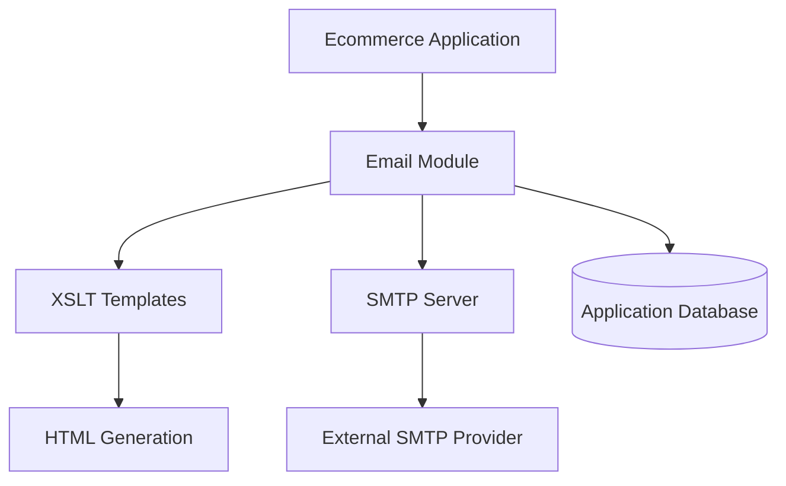
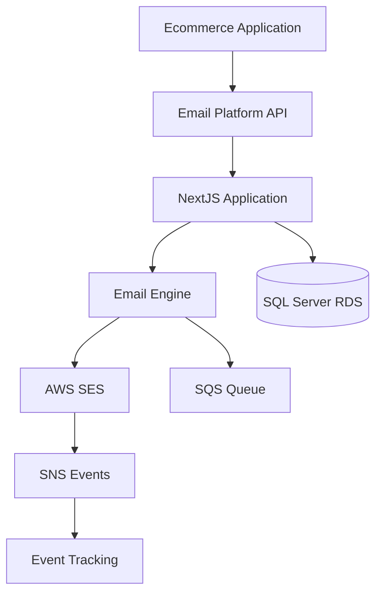

# Migration Strategy - Email Platform

## Overview

This document outlines the comprehensive strategy for migrating from the existing on-premise email system integrated within the ecommerce platform to the new cloud-based, multitenant Email Platform.

## Migration Scope

### Current State Analysis

#### Existing System Architecture
- **Integration**: Tightly coupled email module within ecommerce application
- **Templates**: XSLT-based templates with HTML output
- **Email Types**: 
  - Forgot Password
  - Welcome emails
  - Order Confirmation
  - Shipment Confirmation
- **Configuration**: Basic subject, from, and additional recipient settings
- **Limitations**:
  - No delivery tracking
  - No engagement analytics
  - Limited scalability
  - Maintenance complexity

#### Technical Dependencies


### Target State Architecture


## Migration Phases

### Phase 1: Infrastructure and Foundation (Weeks 1-2)

#### Objectives
- Establish AWS infrastructure
- Set up CI/CD pipelines
- Deploy basic application structure
- Configure monitoring and logging

#### Deliverables
- ✅ AWS environment provisioned
- ✅ ECS Fargate clusters deployed
- ✅ RDS SQL Server instance configured
- ✅ Cognito User Pools set up
- ✅ Basic NextJS application deployed
- ✅ Monitoring infrastructure active

#### Activities

**Week 1: AWS Foundation**
```bash
# Day 1-2: AWS Account Setup
- Configure AWS Organizations and accounts
- Set up IAM roles and policies
- Establish billing alerts and cost controls

# Day 3-4: Core Infrastructure
- Deploy VPC, subnets, and security groups
- Set up RDS SQL Server with Multi-AZ
- Configure ElastiCache Redis cluster
- Establish S3 buckets for assets and logs

# Day 5: Security and Compliance
- Configure AWS KMS for encryption
- Set up AWS Secrets Manager
- Enable CloudTrail for audit logging
- Configure AWS Config for compliance
```

**Week 2: Application Infrastructure**
```bash
# Day 1-2: Container Orchestration
- Set up ECS Fargate clusters
- Configure Application Load Balancer
- Deploy ECR repositories
- Set up auto-scaling policies

# Day 3-4: Monitoring and Logging
- Configure CloudWatch dashboards
- Set up X-Ray tracing
- Deploy centralized logging
- Configure alert notifications

# Day 5: CI/CD Pipeline
- Set up GitHub Actions workflows
- Configure automated testing
- Deploy staging environment
- Test deployment pipeline
```

#### Risk Mitigation
- **Risk**: AWS service limits
  - **Mitigation**: Pre-request service limit increases
- **Risk**: Security misconfigurations
  - **Mitigation**: Use AWS Config rules and Security Hub
- **Risk**: Cost overruns
  - **Mitigation**: Implement detailed cost monitoring and budgets

### Phase 2: Core Platform Development (Weeks 3-4)

#### Objectives
- Implement core email sending functionality
- Develop multitenant architecture
- Create basic template management
- Establish API foundations

#### Deliverables
- ✅ Database schema implemented
- ✅ Tenant isolation mechanisms
- ✅ Email sending API functional
- ✅ Template storage and processing
- ✅ SES integration with basic tracking

#### Activities

**Week 3: Database and Authentication**
```sql
-- Day 1-2: Database Schema
-- Implement core tables: Tenants, Users, Templates, EmailLogs
CREATE TABLE Tenants (
    tenant_id UNIQUEIDENTIFIER PRIMARY KEY DEFAULT NEWID(),
    name NVARCHAR(255) NOT NULL,
    subdomain NVARCHAR(100) UNIQUE,
    settings NVARCHAR(MAX),
    created_at DATETIME2 DEFAULT GETUTCDATE()
);

-- Day 3-4: Row-Level Security
-- Implement tenant isolation policies
CREATE SECURITY POLICY tenant_isolation
ADD FILTER PREDICATE tenant_id = CAST(SESSION_CONTEXT(N'tenant_id') AS UNIQUEIDENTIFIER)
ON EmailLogs;

-- Day 5: Authentication Integration
-- Configure Cognito integration
-- Implement JWT middleware
```

**Week 4: Email Engine Development**
```typescript
// Day 1-2: Email Service Architecture
interface EmailService {
  sendEmail(request: SendEmailRequest): Promise<SendEmailResponse>;
  getEmailStatus(emailId: string): Promise<EmailStatus>;
  processTemplate(templateId: string, data: object): Promise<string>;
}

// Day 3-4: SES Integration
class SESEmailService implements EmailService {
  async sendEmail(request: SendEmailRequest) {
    // Implement SES sending logic
    // Queue processing with SQS
    // Error handling and retries
  }
}

// Day 5: API Development
// Implement REST API endpoints
// Add request validation
// Configure rate limiting
```

#### Migration Tools Development
```bash
# Template migration utility
npm run migrate:templates --source=/path/to/old/templates --tenant=tenant-id

# Configuration migration
npm run migrate:config --source=config.json --tenant=tenant-id

# Test data generation
npm run generate:test-data --tenant=tenant-id --count=1000
```

### Phase 3: Template Migration and Testing (Weeks 5-6)

#### Objectives
- Migrate existing XSLT templates
- Validate template output accuracy
- Implement comprehensive testing
- Set up email tracking and webhooks

#### Deliverables
- ✅ All templates migrated and tested
- ✅ Template output validated against current system
- ✅ Email tracking fully functional
- ✅ Webhook processing implemented
- ✅ Comprehensive test suite

#### Template Migration Process

**Assessment Phase (Week 5, Days 1-2)**
```bash
# Inventory existing templates
./scripts/template-inventory.sh /path/to/current/templates

# Analyze template complexity
./scripts/analyze-templates.sh --output=analysis.json

# Identify custom variables and logic
./scripts/extract-variables.sh --templates=/path/to/templates
```

**Migration Phase (Week 5, Days 3-5)**
```bash
# Automated template conversion
./scripts/convert-templates.sh \
  --source=/path/to/old/templates \
  --output=/path/to/new/templates \
  --tenant=client-tenant-id

# Manual template adjustments
# Review and fix any conversion issues
# Optimize templates for new platform
```

**Validation Phase (Week 6, Days 1-3)**
```bash
# Generate test data for all template types
./scripts/generate-test-data.sh --templates=all --output=test-data.json

# Run template rendering tests
npm run test:templates --data=test-data.json --compare-output

# Visual regression testing
npm run test:visual-regression --templates=all
```

**Tracking Implementation (Week 6, Days 4-5)**
```typescript
// Implement SNS webhook processing
export async function processSESEvent(event: SNSEvent) {
  for (const record of event.Records) {
    const message = JSON.parse(record.Sns.Message);
    
    switch (message.eventType) {
      case 'delivery':
        await updateEmailStatus(message.mail.messageId, 'delivered');
        break;
      case 'bounce':
        await handleBounce(message);
        break;
      case 'complaint':
        await handleComplaint(message);
        break;
    }
  }
}
```

#### Template Migration Checklist
- [ ] **Welcome Email**
  - [ ] Template converted
  - [ ] Variables mapped
  - [ ] Output validated
  - [ ] Responsive design tested
- [ ] **Order Confirmation**
  - [ ] Template converted
  - [ ] Product loop logic verified
  - [ ] Pricing calculations tested
  - [ ] Print-friendly version
- [ ] **Shipment Confirmation**
  - [ ] Template converted
  - [ ] Tracking integration tested
  - [ ] Carrier-specific logic
  - [ ] Delivery date formatting
- [ ] **Password Reset**
  - [ ] Template converted
  - [ ] Security token handling
  - [ ] Expiration logic
  - [ ] Mobile optimization

### Phase 4: Dashboard and Analytics (Weeks 7-8)

#### Objectives
- Develop comprehensive admin dashboard
- Implement real-time analytics
- Create reporting capabilities
- Set up alerting and monitoring

#### Deliverables
- ✅ Admin dashboard functional
- ✅ Real-time email analytics
- ✅ Custom reporting features
- ✅ Alert system operational
- ✅ Performance monitoring active

#### Dashboard Development (Week 7)

**Core Dashboard Features**
```typescript
// Dashboard metrics API
export async function getDashboardMetrics(tenantId: string, period: string) {
  const metrics = await db.query(`
    SELECT 
      COUNT(*) as total_sent,
      SUM(CASE WHEN status = 'delivered' THEN 1 ELSE 0 END) as delivered,
      SUM(CASE WHEN status = 'bounced' THEN 1 ELSE 0 END) as bounced,
      AVG(DATEDIFF(second, sent_at, delivered_at)) as avg_delivery_time
    FROM EmailLogs 
    WHERE tenant_id = @tenantId 
    AND sent_at >= @startDate
  `, { tenantId, startDate: getPeriodStart(period) });
  
  return metrics;
}
```

**Real-time Updates**
```typescript
// Server-Sent Events for real-time updates
export function setupSSE(tenantId: string) {
  const eventSource = new EventSource(`/api/sse/dashboard?tenant=${tenantId}`);
  
  eventSource.onmessage = (event) => {
    const data = JSON.parse(event.data);
    updateDashboardMetrics(data);
  };
}
```

#### Analytics Engine (Week 8)

**Advanced Analytics Queries**
```sql
-- Email performance by type
WITH EmailPerformance AS (
  SELECT 
    email_type,
    COUNT(*) as sent,
    COUNT(CASE WHEN ee.event_type = 'delivery' THEN 1 END) as delivered,
    COUNT(CASE WHEN ee.event_type = 'open' THEN 1 END) as opened,
    COUNT(CASE WHEN ee.event_type = 'click' THEN 1 END) as clicked
  FROM EmailLogs el
  LEFT JOIN EmailEvents ee ON el.log_id = ee.log_id
  WHERE el.tenant_id = @tenantId
  AND el.sent_at >= @startDate
  GROUP BY email_type
)
SELECT *,
  (delivered * 100.0 / sent) as delivery_rate,
  (opened * 100.0 / delivered) as open_rate,
  (clicked * 100.0 / opened) as click_rate
FROM EmailPerformance;
```

**Automated Reporting**
```typescript
// Weekly performance report generation
export async function generateWeeklyReport(tenantId: string) {
  const report = await compileWeeklyMetrics(tenantId);
  const pdf = await generatePDFReport(report);
  
  await emailReport({
    to: await getTenantAdmins(tenantId),
    subject: 'Weekly Email Performance Report',
    attachment: pdf
  });
}
```

### Phase 5: Pilot Integration (Weeks 9-10)

#### Objectives
- Integrate first pilot client
- Run parallel sending for validation
- Perform load testing
- Optimize performance based on real usage

#### Deliverables
- ✅ Pilot client fully integrated
- ✅ Parallel sending validation complete
- ✅ Performance optimizations implemented
- ✅ Load testing results documented
- ✅ Support procedures established

#### Pilot Client Selection Criteria
- **Low to medium email volume** (< 10,000 emails/day)
- **Standard email types** (no complex customizations)
- **Technical team available** for integration support
- **Flexible timeline** for issue resolution

#### Integration Process

**Phase A: API Integration (Week 9, Days 1-3)**
```typescript
// Current ecommerce integration
class CurrentEmailService {
  sendWelcomeEmail(user: User) {
    // Old email sending logic
  }
}

// New platform integration
class EmailPlatformService {
  async sendWelcomeEmail(user: User) {
    const response = await fetch(`${EMAIL_PLATFORM_API}/v1/emails/send`, {
      method: 'POST',
      headers: {
        'Content-Type': 'application/json',
        'X-API-Key': process.env.EMAIL_PLATFORM_API_KEY,
        'X-Tenant-ID': process.env.TENANT_ID
      },
      body: JSON.stringify({
        type: 'welcome',
        recipient: {
          email: user.email,
          name: user.name
        },
        data: {
          user_name: user.name,
          activation_link: generateActivationLink(user.id)
        }
      })
    });
    
    return response.json();
  }
}
```

**Phase B: Parallel Sending (Week 9, Days 4-5)**
```typescript
// Dual-send implementation for validation
class DualSendEmailService {
  async sendEmail(type: string, data: any) {
    const [oldResult, newResult] = await Promise.allSettled([
      this.oldEmailService.sendEmail(type, data),
      this.newEmailService.sendEmail(type, data)
    ]);
    
    // Log results for comparison
    await this.logComparison({
      emailType: type,
      oldResult,
      newResult,
      timestamp: new Date()
    });
    
    // Return old result for now (fail-safe)
    return oldResult.status === 'fulfilled' ? oldResult.value : newResult.value;
  }
}
```

**Phase C: Load Testing (Week 10, Days 1-3)**
```bash
# Email volume simulation
./scripts/load-test.sh \
  --concurrent-users=100 \
  --emails-per-minute=1000 \
  --duration=30m \
  --email-types=welcome,order_confirmation

# Database performance testing
./scripts/db-load-test.sh \
  --connections=50 \
  --queries-per-second=500 \
  --duration=1h

# API endpoint testing
artillery run load-test-config.yml
```

#### Validation Metrics
- **Email Delivery Accuracy**: 99.9% match with current system
- **Response Time**: < 200ms for API calls
- **Throughput**: Handle 1000+ emails/minute
- **Error Rate**: < 0.1% failed requests

### Phase 6: Full Migration Rollout (Weeks 11-12)

#### Objectives
- Migrate all remaining clients
- Decommission old email system
- Provide comprehensive training
- Establish ongoing support procedures

#### Deliverables
- ✅ All clients migrated successfully
- ✅ Old system decommissioned
- ✅ Team training completed
- ✅ Support documentation finalized
- ✅ Monitoring and alerting operational

#### Client Migration Schedule

**Week 11: High-Priority Clients**
- Day 1-2: Client A (Enterprise, high volume)
- Day 3-4: Client B (Mid-market, complex templates)
- Day 5: Client C (Small business, standard templates)

**Week 12: Remaining Clients**
- Day 1-3: Batch migration of 5-10 remaining clients
- Day 4: System validation and monitoring
- Day 5: Old system decommission

#### Migration Per Client Process

**Pre-Migration Checklist (24-48 hours before)**
- [ ] Templates migrated and tested
- [ ] API keys generated and tested
- [ ] DNS records updated for tracking
- [ ] Monitoring alerts configured
- [ ] Support team notified
- [ ] Rollback plan confirmed

**Migration Day Process**
```bash
# Hour 0: Final preparation
./scripts/pre-migration-check.sh --client=client-id

# Hour 1: API integration deployment
./scripts/deploy-integration.sh --client=client-id --environment=production

# Hour 2-4: Gradual traffic shift
./scripts/traffic-shift.sh --client=client-id --percentage=25
./scripts/traffic-shift.sh --client=client-id --percentage=50
./scripts/traffic-shift.sh --client=client-id --percentage=100

# Hour 5-6: Validation and monitoring
./scripts/validate-migration.sh --client=client-id
./scripts/monitor-health.sh --client=client-id --duration=2h

# Hour 7: Post-migration cleanup
./scripts/post-migration-cleanup.sh --client=client-id
```

**Post-Migration Validation (24-48 hours after)**
- [ ] Email volume matches expected levels
- [ ] Delivery rates maintain or improve
- [ ] No increase in bounce/complaint rates
- [ ] Client satisfaction confirmed
- [ ] Performance metrics within targets

## Risk Management

### Critical Risks and Mitigation Strategies

#### 1. **Email Delivery Failures**
**Risk Level**: Critical
**Impact**: Business disruption, customer complaints
**Mitigation**:
- Implement circuit breaker pattern
- Maintain fallback to old system during transition
- 24/7 monitoring with immediate alerts
- Pre-warm SES sending reputation

#### 2. **Data Loss During Migration**
**Risk Level**: High
**Impact**: Lost email history, compliance issues
**Mitigation**:
- Full database backups before migration
- Parallel data synchronization
- Data validation checksums
- Rollback procedures tested

#### 3. **Performance Degradation**
**Risk Level**: Medium
**Impact**: Slow email sending, API timeouts
**Mitigation**:
- Load testing before migration
- Auto-scaling configuration
- Performance monitoring
- Capacity planning

#### 4. **Security Vulnerabilities**
**Risk Level**: High
**Impact**: Data breach, compliance violations
**Mitigation**:
- Security assessment before go-live
- Encryption for all data
- Access controls and audit logging
- Penetration testing

### Rollback Procedures

#### Emergency Rollback (< 1 hour)
```bash
# Immediate traffic redirect
./scripts/emergency-rollback.sh --client=client-id
# - Redirect API calls to old system
# - Update DNS records
# - Disable new platform processing
# - Notify support team
```

#### Planned Rollback (< 4 hours)
```bash
# Coordinated rollback with data preservation
./scripts/planned-rollback.sh --client=client-id --preserve-data=true
# - Export email logs from new system
# - Revert API integrations
# - Restore old system configurations
# - Import preserved data
```

## Success Metrics and KPIs

### Technical Metrics
- **Email Delivery Rate**: > 99%
- **API Response Time**: < 200ms (95th percentile)
- **System Uptime**: > 99.9%
- **Processing Capacity**: > 10,000 emails/minute

### Business Metrics
- **Migration Success Rate**: 100% of clients migrated
- **Customer Satisfaction**: > 90% satisfaction score
- **Support Tickets**: < 10 tickets per week post-migration
- **Time to Resolution**: < 2 hours for critical issues

### Compliance Metrics
- **Data Retention**: 100% compliance with policies
- **Audit Trail**: Complete logging of all actions
- **Security Incidents**: 0 security breaches
- **GDPR Compliance**: 100% compliant processes

## Post-Migration Support

### Support Tiers

#### Tier 1: Self-Service
- Comprehensive documentation
- Video tutorials
- FAQ database
- Community forums

#### Tier 2: Standard Support
- Email support (4-hour response)
- Chat support (business hours)
- Remote assistance
- Basic troubleshooting

#### Tier 3: Premium Support
- Phone support (1-hour response)
- Dedicated account manager
- Proactive monitoring
- Custom integration assistance

### Training Program

#### Administrator Training (4 hours)
- Platform overview and navigation
- User management and permissions
- Template creation and editing
- Analytics and reporting
- Troubleshooting common issues

#### Developer Training (6 hours)
- API integration patterns
- Authentication and security
- Error handling best practices
- Testing and debugging tools
- Performance optimization

#### End-User Training (2 hours)
- Dashboard navigation
- Creating and editing templates
- Monitoring email performance
- Generating reports

This comprehensive migration strategy ensures a smooth transition from the legacy email system to the new Email Platform while minimizing risks and maintaining business continuity.