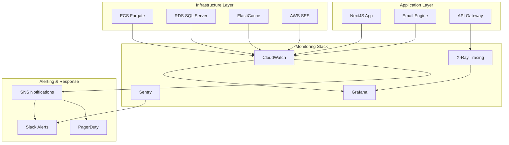

# Monitoring Strategy - Email Platform

## Overview

Comprehensive monitoring and observability strategy for the Email Platform, covering application performance, infrastructure health, business metrics, and user experience across all components of the system.

## Monitoring Architecture



## Key Performance Indicators (KPIs)

### 1. Application Performance Metrics

#### Email Processing KPIs
```typescript
interface EmailMetrics {
  // Volume Metrics
  emailsPerMinute: number;          // Target: >1000/min
  emailsPerHour: number;            // Target: >60,000/hour
  dailyVolume: number;              // Track growth trends
  
  // Performance Metrics
  apiResponseTime: {
    p50: number;                    // Target: <100ms
    p95: number;                    // Target: <200ms
    p99: number;                    // Target: <500ms
  };
  
  templateProcessingTime: {
    p50: number;                    // Target: <200ms
    p95: number;                    // Target: <500ms
    p99: number;                    // Target: <1000ms
  };
  
  queueProcessingTime: {
    average: number;                // Target: <30s
    p95: number;                    // Target: <60s
  };
  
  // Reliability Metrics
  emailDeliveryRate: number;        // Target: >99%
  apiSuccessRate: number;           // Target: >99.9%
  systemUptime: number;             // Target: >99.9%
}
```

#### User Experience Metrics
```typescript
interface UXMetrics {
  // Dashboard Performance
  pageLoadTime: {
    dashboard: number;              // Target: <2s
    analytics: number;              // Target: <3s
    templates: number;              // Target: <2s
  };
  
  // User Engagement
  dailyActiveUsers: number;
  sessionDuration: number;
  bounceRate: number;               // Target: <20%
  
  // Feature Adoption
  templateEditorUsage: number;
  apiIntegrationCount: number;
  reportGenerationCount: number;
}
```

### 2. Infrastructure Health Metrics

#### Compute Resources
```yaml
ecs_metrics:
  cpu_utilization:
    target: <70%
    alert_threshold: >85%
    critical_threshold: >95%
  
  memory_utilization:
    target: <80%
    alert_threshold: >90%
    critical_threshold: >95%
  
  task_health:
    healthy_tasks_percentage: >95%
    task_start_time: <30s
    task_stop_time: <10s

database_metrics:
  connection_count:
    target: <80% of max
    alert_threshold: >90%
  
  query_performance:
    avg_query_time: <50ms
    slow_query_count: <10/hour
  
  storage_usage:
    alert_threshold: >80%
    critical_threshold: >90%

cache_metrics:
  hit_ratio:
    target: >90%
    alert_threshold: <80%
  
  memory_usage:
    alert_threshold: >85%
    critical_threshold: >95%
  
  connection_count:
    alert_threshold: >80% of max
```

### 3. Business Intelligence Metrics

#### Email Effectiveness
```sql
-- Daily email performance summary
WITH DailyMetrics AS (
  SELECT 
    CAST(sent_at AS DATE) as date,
    tenant_id,
    email_type,
    COUNT(*) as emails_sent,
    COUNT(CASE WHEN status = 'delivered' THEN 1 END) as emails_delivered,
    COUNT(CASE WHEN ee.event_type = 'open' THEN 1 END) as emails_opened,
    COUNT(CASE WHEN ee.event_type = 'click' THEN 1 END) as emails_clicked,
    COUNT(CASE WHEN status = 'bounced' THEN 1 END) as emails_bounced
  FROM EmailLogs el
  LEFT JOIN EmailEvents ee ON el.log_id = ee.log_id
  WHERE sent_at >= DATEADD(day, -30, GETUTCDATE())
  GROUP BY CAST(sent_at AS DATE), tenant_id, email_type
)
SELECT *,
  (emails_delivered * 100.0 / emails_sent) as delivery_rate,
  (emails_opened * 100.0 / emails_delivered) as open_rate,
  (emails_clicked * 100.0 / emails_opened) as click_rate,
  (emails_bounced * 100.0 / emails_sent) as bounce_rate
FROM DailyMetrics;
```

#### Revenue Impact Metrics
```typescript
interface RevenueMetrics {
  // Cost Efficiency
  costPerEmail: number;             // Track AWS costs vs volume
  costPerDeliveredEmail: number;
  monthlyOperatingCost: number;
  
  // ROI Metrics
  emailAttributedRevenue: number;   // From click tracking
  conversionRate: number;           // Email clicks to purchases
  customerLifetimeValue: number;    // Email engagement impact
  
  // Growth Metrics
  newTenantCount: number;
  tenantChurnRate: number;
  averageEmailsPerTenant: number;
}
```

## Monitoring Implementation

### 1. Application Monitoring

#### Custom Metrics Collection
```typescript
// Custom CloudWatch metrics for email processing
import { CloudWatch } from 'aws-sdk';

class EmailMetricsCollector {
  private cloudwatch = new CloudWatch();
  
  async recordEmailSent(tenantId: string, emailType: string) {
    await this.cloudwatch.putMetricData({
      Namespace: 'EmailPlatform/Emails',
      MetricData: [{
        MetricName: 'EmailsSent',
        Value: 1,
        Unit: 'Count',
        Dimensions: [
          { Name: 'TenantId', Value: tenantId },
          { Name: 'EmailType', Value: emailType }
        ],
        Timestamp: new Date()
      }]
    }).promise();
  }
  
  async recordApiLatency(endpoint: string, latency: number) {
    await this.cloudwatch.putMetricData({
      Namespace: 'EmailPlatform/API',
      MetricData: [{
        MetricName: 'ResponseTime',
        Value: latency,
        Unit: 'Milliseconds',
        Dimensions: [
          { Name: 'Endpoint', Value: endpoint }
        ],
        Timestamp: new Date()
      }]
    }).promise();
  }
  
  async recordTemplateProcessingTime(templateId: string, processingTime: number) {
    await this.cloudwatch.putMetricData({
      Namespace: 'EmailPlatform/Templates',
      MetricData: [{
        MetricName: 'ProcessingTime',
        Value: processingTime,
        Unit: 'Milliseconds',
        Dimensions: [
          { Name: 'TemplateId', Value: templateId }
        ],
        Timestamp: new Date()
      }]
    }).promise();
  }
}
```

#### Error Tracking with Sentry
```typescript
import * as Sentry from '@sentry/nextjs';

// Configure Sentry for comprehensive error tracking
Sentry.init({
  dsn: process.env.NEXT_PUBLIC_SENTRY_DSN,
  environment: process.env.NODE_ENV,
  integrations: [
    new Sentry.Integrations.Http({ tracing: true }),
    new Sentry.Integrations.Express({ app })
  ],
  tracesSampleRate: 0.1,
  beforeSend(event) {
    // Filter out non-critical errors
    if (event.level === 'warning' && event.tags?.source === 'client') {
      return null;
    }
    return event;
  }
});

// Custom error context for email processing
export function trackEmailError(error: Error, context: {
  tenantId: string;
  emailId: string;
  emailType: string;
}) {
  Sentry.withScope((scope) => {
    scope.setTag('component', 'email-processing');
    scope.setContext('email', context);
    Sentry.captureException(error);
  });
}
```

#### Performance Monitoring with X-Ray
```typescript
import AWSXRay from 'aws-xray-sdk-core';

// Instrument AWS SDK calls
const AWS = AWSXRay.captureAWS(require('aws-sdk'));

// Custom subsegments for detailed tracing
export async function processEmailWithTracing(emailData: EmailRequest) {
  const segment = AWSXRay.getSegment();
  const subsegment = segment?.addNewSubsegment('email-processing');
  
  try {
    subsegment?.addAnnotation('tenantId', emailData.tenantId);
    subsegment?.addAnnotation('emailType', emailData.type);
    
    // Template processing subsegment
    const templateSubsegment = subsegment?.addNewSubsegment('template-processing');
    const processedTemplate = await processTemplate(emailData);
    templateSubsegment?.close();
    
    // SES sending subsegment
    const sesSubsegment = subsegment?.addNewSubsegment('ses-sending');
    const result = await sendViaSES(processedTemplate);
    sesSubsegment?.close();
    
    subsegment?.addMetadata('result', { messageId: result.messageId });
    return result;
    
  } catch (error) {
    subsegment?.addError(error);
    throw error;
  } finally {
    subsegment?.close();
  }
}
```

### 2. Infrastructure Monitoring

#### CloudWatch Dashboards Configuration
```json
{
  "widgets": [
    {
      "type": "metric",
      "properties": {
        "metrics": [
          ["EmailPlatform/Emails", "EmailsSent", { "stat": "Sum" }],
          [".", "EmailsDelivered", { "stat": "Sum" }],
          [".", "EmailsFailed", { "stat": "Sum" }]
        ],
        "period": 300,
        "stat": "Sum",
        "region": "us-east-1",
        "title": "Email Volume",
        "yAxis": {
          "left": {
            "min": 0
          }
        }
      }
    },
    {
      "type": "metric",
      "properties": {
        "metrics": [
          ["EmailPlatform/API", "ResponseTime", { "stat": "Average" }],
          [".", ".", { "stat": "p95" }],
          [".", ".", { "stat": "p99" }]
        ],
        "period": 300,
        "stat": "Average",
        "region": "us-east-1",
        "title": "API Response Times",
        "yAxis": {
          "left": {
            "min": 0,
            "max": 1000
          }
        }
      }
    },
    {
      "type": "metric",
      "properties": {
        "metrics": [
          ["AWS/ECS", "CPUUtilization", "ServiceName", "email-platform-web"],
          [".", "MemoryUtilization", ".", "."],
          ["AWS/ApplicationELB", "TargetResponseTime", "LoadBalancer", "email-platform-alb"]
        ],
        "period": 300,
        "stat": "Average",
        "region": "us-east-1",
        "title": "Infrastructure Health"
      }
    }
  ]
}
```

#### Log Analysis with CloudWatch Insights
```sql
-- API error analysis
fields @timestamp, @message, level, error, tenantId
| filter level = "ERROR"
| filter @message like /API/
| stats count() by error
| sort count desc

-- Email processing performance
fields @timestamp, processingTime, emailType, tenantId
| filter @message like /EmailProcessed/
| stats avg(processingTime), max(processingTime), count() by emailType
| sort avg(processingTime) desc

-- Database query performance
fields @timestamp, @message, queryTime, query
| filter @message like /SlowQuery/
| filter queryTime > 1000
| stats count() by query
| sort count desc
```

### 3. Alerting Configuration

#### Critical Alerts (Immediate Response)
```yaml
critical_alerts:
  - name: "Email Processing Failure Rate High"
    condition: "EmailPlatform/Emails/FailureRate > 5%"
    duration: "2 minutes"
    actions:
      - pagerduty_critical
      - slack_alert
    
  - name: "API Error Rate Critical"
    condition: "EmailPlatform/API/ErrorRate > 1%"
    duration: "1 minute"
    actions:
      - pagerduty_critical
      - slack_alert
  
  - name: "Database Connection Failure"
    condition: "AWS/RDS/DatabaseConnections = 0"
    duration: "1 minute"
    actions:
      - pagerduty_critical
      - slack_alert
  
  - name: "SES Reputation Issues"
    condition: "AWS/SES/Reputation.DeliveryDelay > 0"
    duration: "1 minute"
    actions:
      - pagerduty_critical
      - email_alert_admin
```

#### Warning Alerts (Proactive Monitoring)
```yaml
warning_alerts:
  - name: "High Email Volume"
    condition: "EmailPlatform/Emails/Volume > 10000/hour"
    duration: "5 minutes"
    actions:
      - slack_warning
      - email_alert_team
  
  - name: "API Latency Elevated"
    condition: "EmailPlatform/API/ResponseTime.p95 > 500ms"
    duration: "5 minutes"
    actions:
      - slack_warning
  
  - name: "Template Processing Slow"
    condition: "EmailPlatform/Templates/ProcessingTime.p95 > 1000ms"
    duration: "3 minutes"
    actions:
      - slack_warning
  
  - name: "Memory Usage High"
    condition: "AWS/ECS/MemoryUtilization > 85%"
    duration: "10 minutes"
    actions:
      - slack_warning
      - auto_scale_trigger
```

#### Info Alerts (Operational Awareness)
```yaml
info_alerts:
  - name: "New Tenant Onboarded"
    condition: "EmailPlatform/Tenants/NewTenant = 1"
    actions:
      - slack_info
      - webhook_crm_update
  
  - name: "Daily Volume Report"
    schedule: "0 9 * * *"  # 9 AM daily
    actions:
      - email_daily_report
      - slack_summary
  
  - name: "Weekly Performance Summary"
    schedule: "0 9 * * 1"  # 9 AM Mondays
    actions:
      - email_weekly_report
      - dashboard_update
```

### 4. Custom Monitoring Tools

#### Real-time Health Check Dashboard
```typescript
// Health check API endpoint
export async function GET() {
  const healthChecks = await Promise.allSettled([
    checkDatabaseHealth(),
    checkRedisHealth(),
    checkSESHealth(),
    checkQueueHealth()
  ]);
  
  const overallHealth = healthChecks.every(
    check => check.status === 'fulfilled' && check.value.healthy
  );
  
  return Response.json({
    timestamp: new Date().toISOString(),
    status: overallHealth ? 'healthy' : 'unhealthy',
    services: {
      database: healthChecks[0],
      cache: healthChecks[1],
      email: healthChecks[2],
      queue: healthChecks[3]
    },
    uptime: process.uptime(),
    version: process.env.APP_VERSION
  });
}

async function checkDatabaseHealth() {
  try {
    const start = Date.now();
    await db.raw('SELECT 1');
    const latency = Date.now() - start;
    
    return {
      healthy: latency < 100,
      latency,
      message: latency < 100 ? 'OK' : 'High latency'
    };
  } catch (error) {
    return {
      healthy: false,
      error: error.message,
      message: 'Database connection failed'
    };
  }
}
```

#### Automated Performance Analysis
```typescript
// Weekly performance analysis
export async function analyzeWeeklyPerformance() {
  const analysis = {
    emailVolume: await getWeeklyEmailVolume(),
    performanceTrends: await getPerformanceTrends(),
    errorAnalysis: await getErrorAnalysis(),
    costAnalysis: await getCostAnalysis(),
    recommendations: []
  };
  
  // Generate recommendations based on data
  if (analysis.performanceTrends.apiLatency.trend === 'increasing') {
    analysis.recommendations.push({
      type: 'performance',
      priority: 'medium',
      message: 'API latency trending upward, consider scaling or optimization'
    });
  }
  
  if (analysis.emailVolume.growth > 50) {
    analysis.recommendations.push({
      type: 'capacity',
      priority: 'high',
      message: 'Email volume increased by 50%+, review capacity planning'
    });
  }
  
  // Send analysis to stakeholders
  await sendPerformanceAnalysis(analysis);
  return analysis;
}
```

## Monitoring Tools Integration

### 1. Grafana Dashboards

#### Email Platform Overview Dashboard
```json
{
  "dashboard": {
    "title": "Email Platform - Overview",
    "panels": [
      {
        "title": "Email Volume (24h)",
        "type": "stat",
        "targets": [
          {
            "expr": "sum(rate(email_platform_emails_sent_total[24h]))",
            "legendFormat": "Emails/sec"
          }
        ]
      },
      {
        "title": "Delivery Rate",
        "type": "gauge",
        "targets": [
          {
            "expr": "rate(email_platform_emails_delivered_total[1h]) / rate(email_platform_emails_sent_total[1h]) * 100",
            "legendFormat": "Delivery %"
          }
        ],
        "fieldConfig": {
          "min": 0,
          "max": 100,
          "thresholds": {
            "steps": [
              { "color": "red", "value": 0 },
              { "color": "yellow", "value": 95 },
              { "color": "green", "value": 99 }
            ]
          }
        }
      },
      {
        "title": "API Performance",
        "type": "timeseries",
        "targets": [
          {
            "expr": "histogram_quantile(0.50, rate(http_request_duration_seconds_bucket[5m]))",
            "legendFormat": "P50"
          },
          {
            "expr": "histogram_quantile(0.95, rate(http_request_duration_seconds_bucket[5m]))",
            "legendFormat": "P95"
          },
          {
            "expr": "histogram_quantile(0.99, rate(http_request_duration_seconds_bucket[5m]))",
            "legendFormat": "P99"
          }
        ]
      }
    ]
  }
}
```

### 2. PagerDuty Integration

#### Escalation Policies
```yaml
escalation_policy:
  name: "Email Platform Critical"
  escalation_rules:
    - escalation_delay_in_minutes: 0
      targets:
        - type: "user"
          id: "primary_oncall"
    
    - escalation_delay_in_minutes: 15
      targets:
        - type: "user"
          id: "secondary_oncall"
    
    - escalation_delay_in_minutes: 30
      targets:
        - type: "user"
          id: "engineering_manager"

service:
  name: "Email Platform"
  escalation_policy: "Email Platform Critical"
  alert_creation: "create_alerts_and_incidents"
  auto_resolve_timeout: 14400  # 4 hours
```

### 3. Slack Integration

#### Alert Formatting
```typescript
// Custom Slack alert formatting
export function formatSlackAlert(alert: Alert) {
  const color = alert.severity === 'critical' ? 'danger' : 
                alert.severity === 'warning' ? 'warning' : 'good';
  
  return {
    channel: alert.severity === 'critical' ? '#alerts-critical' : '#alerts-general',
    attachments: [{
      color,
      title: `🚨 ${alert.title}`,
      fields: [
        {
          title: 'Service',
          value: alert.service,
          short: true
        },
        {
          title: 'Severity',
          value: alert.severity.toUpperCase(),
          short: true
        },
        {
          title: 'Description',
          value: alert.description,
          short: false
        },
        {
          title: 'Runbook',
          value: `<${alert.runbookUrl}|View Runbook>`,
          short: true
        }
      ],
      footer: 'Email Platform Monitoring',
      ts: Math.floor(Date.now() / 1000)
    }]
  };
}
```

## Performance Baselines and SLAs

### Service Level Objectives (SLOs)

#### Email Delivery SLO
- **Objective**: 99.5% of emails delivered within 1 minute
- **Measurement**: Time from API call to SES delivery confirmation
- **Error Budget**: 0.5% monthly allowance for delays/failures

#### API Performance SLO
- **Objective**: 95% of API requests complete within 200ms
- **Measurement**: End-to-end response time including database queries
- **Error Budget**: 5% monthly allowance for slow responses

#### System Availability SLO
- **Objective**: 99.9% uptime for email sending capability
- **Measurement**: Health check endpoint availability
- **Error Budget**: 43.2 minutes monthly downtime allowance

### Performance Baselines
```typescript
interface PerformanceBaselines {
  // API Performance
  apiResponseTime: {
    p50: 80,      // ms
    p95: 150,     // ms  
    p99: 300      // ms
  };
  
  // Email Processing
  templateProcessing: {
    simple: 100,   // ms - text only
    complex: 300,  // ms - with images/styling
    bulk: 50       // ms - batch processing per email
  };
  
  // Database Performance
  queryPerformance: {
    simple: 10,    // ms - single table queries
    complex: 50,   // ms - joins and aggregations
    analytics: 200 // ms - reporting queries
  };
  
  // Infrastructure
  resourceUtilization: {
    cpu: 60,       // % target utilization
    memory: 70,    // % target utilization
    connections: 50 // % of max connections
  };
}
```

This comprehensive monitoring strategy ensures proactive identification of issues, maintains high service quality, and provides the visibility needed to operate the Email Platform at scale.